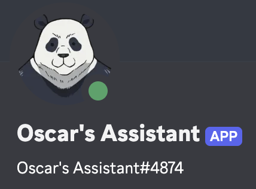

# panda-bot 🐼

Oscar's Discord AI agent, built **from scratch**: plain Node.js + discord.js v14 + an
**OpenRouter** tool-calling loop. Per-server memory, music, self-hosted web/image search,
GitHub vault integration, self-fixing source code, private mode, and emoji reactions.



## Quick start (local)

```bash
cp .env.example .env        # fill in your tokens/keys
cd searxng && cp config/settings.example.yml config/settings.yml
#   set a secret: openssl rand -hex 32  →  paste into config/settings.yml
docker compose up -d        # start the search backend
cd ..
npm install
./run.sh                    # or npm start — generates the gitignored start.sh
                            # supervisor, which pulls main before every boot
# or: npm run start:once (one run, no pull/restart loop) · npm test (unit tests)
```

## Deploy with Docker (CI/CD → Docker Hub)

Every push to **`main`** builds the bot into a Docker image and publishes it to Docker Hub
via GitHub Actions (`.github/workflows/docker.yml`). The full stack (bot + SearXNG) runs
from [`docker-compose.deploy.yml`](docker-compose.deploy.yml).

**One-time setup** — add these as GitHub repo secrets (Settings → Secrets and variables →
Actions):

| Secret | Value |
|---|---|
| `DOCKERHUB_USERNAME` | your Docker Hub username |
| `DOCKERHUB_TOKEN` | a Docker Hub access token (Account Settings → Security) |

The image is published as `<DOCKERHUB_USERNAME>/oscars-assistant-discord-bot` tagged
`latest` and the commit SHA.

**Run the published stack** on any Docker host:

```bash
cp .env.example .env                       # fill in real secrets on the server
export DOCKERHUB_USERNAME=youruser
docker compose -f docker-compose.deploy.yml up -d
```

This starts SearXNG and the bot together on a private network; the bot reaches search at
`http://searxng:8080` (wired automatically). Bot state persists in the `panda-data` volume.

> `self_fix` and `create_pr` never edit the running container or local checkout. They use a
> remote GitHub Actions sandbox, so they work the same way for Docker and local deployments.
> The container runs `node src/index.js` directly; after a self-fix merges, your deployment
> mechanism should roll out the new `main` image as usual.

## Search backend (SearXNG — no rate limits)

Web/image search runs against a private, self-hosted
[SearXNG](https://github.com/searxng/searxng) metasearch instance in `searxng/`
(bot-limiter disabled → no external rate limits). The bot reads `SEARXNG_URL`
(default `http://127.0.0.1:8888` locally, `http://searxng:8080` in the deploy compose).
If it's down, `web_search` falls back to Brave (if `BRAVE_API_KEY` is set) →
Jina-reads-DDG → direct DuckDuckGo.

## How it works

- Mention @Panda or reply to it → the message (with sender name + id inline) goes to
  **OpenRouter** (`OPENROUTER_MODEL`, default `google/gemini-2.5-flash`) with a tool belt;
  the model calls tools until it has an answer. (DMs are ignored by default.)
- **Context is per server** (all channels share one transcript; other servers are
  isolated). Stored in `data/context/<guildId>.json`, trimmed to the last ~60 messages.
- **Always responds:** every message that mentions Panda or replies to it — from a user
  **or** a bot — gets a response. The model decides text / reaction / both (`react` tool);
  if it produces neither, the handler falls back to a 👀 reaction.
- **3-second input debounce + queue:** the first triggering message from a sender opens a
  3s collection batch; everything they say during those 3s is concatenated into one input
  (the timer does **not** reset). Triggers from other senders are queued, not dropped, and
  batches run one at a time per channel in arrival order — this paces bot↔bot ping loops.
- **Private mode:** `/private on` (Oscar only) makes Panda respond to Oscar and nobody
  else; everyone else gets *"I am in a private conversation with Oscar right now."* and the
  model is never called for them. State is a flag file (`data/private-mode.flag`) that
  survives restarts. `/private off` re-opens.
- **Self-fix mode:** while a `self_fix` is running the bot answers **nobody** through the
  model — triggering messages get a single hardcoded "I'm rebuilding myself, back soon"
  reply with no AI processing. The lock is in-memory and self-releases after 15 min.

## Skills (AI tools)

| Tool | What it does |
|---|---|
| `get_user_id` | find a member/bot id by name → ping with `<@id>` |
| `get_message_sender` | id/name of whoever sent the current message |
| `web_search` | self-hosted **SearXNG** → Brave (if key) → Jina/DDG → DDG; cites links |
| `web_fetch` | reads a full page as clean markdown via Jina Reader (`r.jina.ai`) |
| `image_search` | SearXNG images → DuckDuckGo fallback; returns direct URLs Discord embeds |
| `vault_fetch` | reads Oscar's private vault GitHub repo (list/read/search paths) |
| `github` | any GitHub REST endpoint, authenticated as the configured user *(owner only)* |
| `create_pr` | request a remote-sandbox PR on **any** permitted repo *(owner only)* |
| `clear_context` / `clear_all_context` | wipe this server's memory / ALL memory *(all owner)* |
| `self_fix` | remote-sandbox change → verified PR → auto-merge → restart *(owner only)* |
| `play_music` | AI-routed music: "play X", skip, pause, resume, stop, queue |
| `react` | react to the current message with an emoji |

**Development workflow:** `self_fix` and `create_pr` begin with a Discord UI approval card —
click **Approve remote sandbox** or **Cancel**. Text replies cannot approve a code change. On
approval, GitHub Actions checks out a fresh isolated copy of the target repo, calls the custom
`OPENROUTER_DEV_MODEL`, applies only a JSON edit plan, runs JavaScript and project tests, then
opens a detailed PR. The live bot checkout is never read or edited. A self-fix targets Panda’s
own repo, enables GitHub auto-merge, waits for the PR to merge, and only then restarts. Every
self-fix commit is titled `🛠️ Self-fix: <short task>` and includes the approved task, detailed
description, changed files, model, and verification results in its commit body and PR body.

### One-time development sandbox setup

The workflow file is [`.github/workflows/development-sandbox.yml`](.github/workflows/development-sandbox.yml).
After this refactor is pushed to the repository that runs Panda, add these repository **Actions
secrets** there:

| Secret | Value |
|---|---|
| `OPENROUTER_API_KEY` | the key for the custom development model |
| `PANDA_DEV_GITHUB_TOKEN` | a fine-grained PAT with **Contents: read/write** and **Pull requests: read/write** on every repo Panda may change |

Set these bot environment values (the first usually matches Panda’s own repo):

```bash
OPENROUTER_DEV_MODEL=your-org/your-development-model
DEVELOPMENT_SANDBOX_REPO=oskip0906/oscars-assistant-discord-bot
DEVELOPMENT_SANDBOX_WORKFLOW=development-sandbox.yml
DEVELOPMENT_SANDBOX_REF=main
```

`GITHUB_PAT` must have **Actions: write** plus pull-request read access on the sandbox repo so
it can dispatch and observe the workflow. `PANDA_DEV_GITHUB_TOKEN` needs access to every
target repo because the sandbox uses it only to clone, push its short-lived branch, and open
the PR.
Enable **Allow auto-merge** in that repository’s GitHub settings; branch protection can still
require checks/reviews, and Panda will wait until GitHub reports the PR merged. For other repos,
Panda opens the PR and waits for your normal review/merge process instead of auto-merging.

### Start scripts

`run.sh` is the entry point; on an unsupervised launch it generates **`start.sh`** (gitignored)
and hands over to it. `start.sh` is the long-lived supervisor: it runs `git pull --ff-only
origin main` before every boot, then `run.sh` runs the bot once and passes node's exit code
back up (0 = stop, 42 = self-fix restart, anything else = crash, retry in 3s). The supervisor
has to be gitignored because bash reads a script as it executes it — a `git pull` rewriting
the running loop mid-flight would corrupt it. Edit the template in `run.sh`; bump its version
marker to have an existing `start.sh` regenerated.

## Slash commands

`/menu` · `/usage` · `/model` · `/play` `/skip` `/pause` `/resume` `/stop` `/queue` ·
`/web_search` `/web_fetch` `/image_search` `/vault_fetch` · `/clear` · `/clearall` (owner) ·
`/github` (owner) · `/self_fix` (owner) · `/switch_model` (owner) ·
`/private on|off|status` (owner)

`/switch_model` autocompletes against OpenRouter's live catalogue, writes the chosen id to
`OPENROUTER_MODEL` in `.env`, and restarts (exit 42) so the new model is actually loaded.
Every GitHub surface — the `github` tool, `create_pr`, `self_fix`,
and the `/github` command — is **Oscar-only**, enforced in code against the authenticated
Discord id. `vault_fetch` is the deliberate exception: guests use it to ask about Oscar, and
it only ever reads the one vault repo.

`/web_search`, `/web_fetch`, `/image_search`, `/vault_fetch`, and `/github` each take a
**single free-text field** in the Discord UI (query / url / body) — no fiddly structured
parameters. Registered **per guild** on startup (instant availability).
